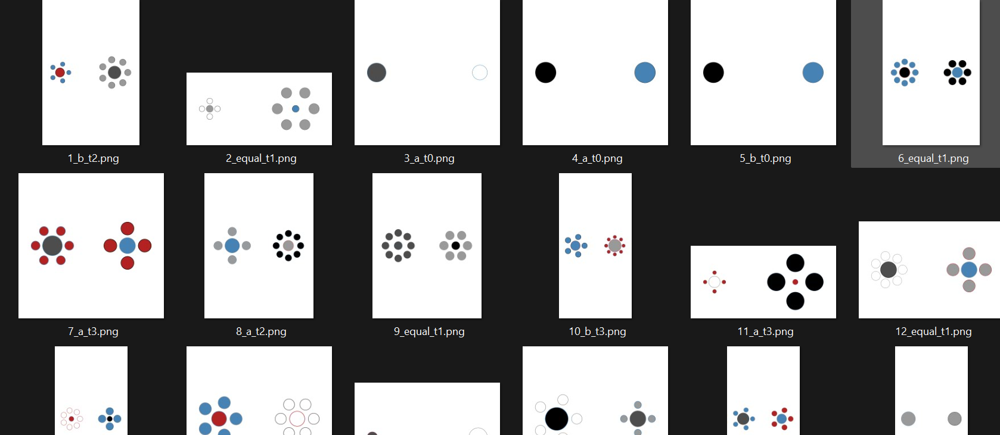

# Ebbinghaus Illusion Benchmark

A flexible R toolkit for generating variants of the Ebbinghaus illusion and evaluating vision-language model (VLM) accuracy on them. The project provides a straightforward API for the common case - generate stimuli, send them to models, analyze results - while allowing full flexibility over every parameter. The **[trial table](data/trials.csv) is the single source of truth**: every stimulus image is fully determined by a row in this table, and researchers control the experiment entirely through it.

## Quick Start

``` r
# Phase 1: Generate stimuli
source("config/defaults.R")
source("R/generate_design.R")
source("R/render_stimuli.R")

trials <- generate_design(seed = 42, n_per_tier = 5)
render_stimuli(trials)

# Phase 2: Evaluate models
source("R/evaluate.R")
prompts <- read.csv("data/prompts.csv", stringsAsFactors = FALSE)
models  <- list(list(provider = "openai", model = "gpt-5.4-pro"))
tasks   <- run_evals(trials, prompts, models)

# Phase 3: Analyze results
source("R/analyze.R")
results <- analyze_results(tasks = tasks)
```

Phase 1 (stimulus creation) works standalone. Phase 2 requires API keys and the `vitals`/`ellmer` packages. Phase 3 is optional - a convenience layer for standard metrics and plots. See below for details on each phase.

------------------------------------------------------------------------

## Difficulty Tiers

Each trial is assigned a difficulty tier based on the relationship between test sizes and surrounding context shapes. The core illusion principle: **larger surrounds make the enclosed test shape appear smaller**.

| Tier | Name | Condition |
|-------------------|-------------------|----------------------------------|
| 0 | **Sanity check** | No surrounds. Just two shapes - can the model compare sizes at all? |
| 1 | **Classic illusion** | Test sizes are equal, surrounds differ. Pure illusion condition - the correct answer is "equal." |
| 2 | **Incongruent** | Test sizes differ, but surrounds push perception the wrong way. The truly larger shape has larger surrounds, making it appear smaller. |
| 3 | **Congruent** | Test sizes differ, and surrounds reinforce the truth. The truly larger shape has smaller surrounds, making it appear even larger. |

------------------------------------------------------------------------

## Phase 1: Stimulus Creation

Generates trial parameters and renders Ebbinghaus illusion images with known ground truth.

|  |  |
|------------------------------------|------------------------------------|
| **Input** | `config/defaults.R` (parameter pools, size ranges, color palettes) |
| **Output** | `trials` data frame + rendered images in `images/` |

``` r
source("config/defaults.R")
source("R/generate_design.R")
source("R/render_stimuli.R")

trials <- generate_design(seed = 42, n_per_tier = 5)
render_stimuli(trials)
```

This is the most basic use case: generate a balanced design with 5 trials per tier and render the images. To customize, edit `config/defaults.R` before generating (e.g., change shape pools, size ranges, canvas dimensions).



The [trial table](data/trials.csv) can also be constructed by other means - filter an existing table, build one manually, or use any external tool. All downstream functions accept any data frame with the correct schema. See [`VARIABLE_REGISTRY.md`](VARIABLE_REGISTRY.md) for the full trials schema and configuration reference.

------------------------------------------------------------------------

## Phase 2: Evaluation

Sends stimulus images to LLMs and records their responses using the [vitals](https://vitals.tidyverse.org/) evaluation framework. A custom solver sends each image + prompt to the model; a deterministic scorer parses the response and compares to ground truth.

|  |  |
|------------------------------------|------------------------------------|
| **Input** | `trials` data frame, `data/prompts.csv`, model list, API keys (env vars) |
| **Output** | Named list of vitals `Task` objects (viewable with `vitals_view()`) |

``` r
source("R/evaluate.R")

trials  <- read.csv("data/trials.csv", stringsAsFactors = FALSE)
prompts <- read.csv("data/prompts.csv", stringsAsFactors = FALSE)

models <- list(
  list(provider = "openai",     model = "gpt-5.4-pro"),
  list(provider = "anthropic",  model = "claude-sonnet-4-6"),
  list(provider = "anthropic",  model = "claude-opus-4-6"), # within-provider comparison
  list(provider = "google",     model = "gemini-3.1-pro-preview")
)

tasks <- run_evals(trials, prompts, models)
```

Each (prompt, model) combination creates one vitals Task. Images are automatically stripped of ground-truth labels before sending. Prompt templates support placeholders (`{direction_a}`, `{direction_b}`, `{test_a_shape}`, `{test_b_shape}`) that are filled per trial based on orientation.

See [`VARIABLE_REGISTRY.md`](VARIABLE_REGISTRY.md) for the prompts schema and model configuration options.

> **Lightweight alternative:** If you prefer not to depend on `vitals` and `ellmer`, a legacy CSV-based evaluation workflow is available in `R/legacy/evaluate.R`. It writes results directly to `data/evals.csv` without the vitals framework.

------------------------------------------------------------------------

## Phase 3: Analysis

A complementary step that joins evaluation results with trial metadata, computes accuracy and bias metrics, and generates plots. This is provided as a convenience - researchers may prefer to write their own analysis.

|            |                                                              |
|------------------------------------|------------------------------------|
| **Input**  | vitals `Task` objects from Phase 2 (or a legacy `evals.csv`) |
| **Output** | Plots and summary CSVs in `output/`                          |

``` r
source("R/analyze.R")
results <- analyze_results(tasks = tasks)
```

Computed metrics include overall accuracy, accuracy by tier, psychometric curves, illusion susceptibility, spatial bias, congruency effects, d-prime, and more. See [`VARIABLE_REGISTRY.md`](VARIABLE_REGISTRY.md) for the full list of metrics and generated plots.

------------------------------------------------------------------------

## File Structure

```         
Ebbinghaus/
├── config/
│   └── defaults.R              # Configurable parameters (shapes, sizes, colors, etc.)
├── R/
│   ├── draw_shape.R            # Atomic shape drawing
│   ├── draw_trial.R            # Compose full stimulus image from trial parameters
│   ├── verify_trial.R          # Compute ground truth from size parameters
│   ├── classify_tier.R         # Assign difficulty tier
│   ├── generate_trial.R        # Generate a single trial's parameters
│   ├── generate_design.R       # Build a complete design matrix
│   ├── render_stimuli.R        # Batch render trial table to images
│   ├── strip_answer.R          # Strip ground truth from filenames for evaluation
│   ├── evaluate.R              # vitals-based evaluation pipeline (Phase 2)
│   ├── analyze.R               # Metrics and plots (Phase 3)
│   └── legacy/
│       └── evaluate.R          # Pre-vitals evaluation (CSV-based, for reference)
├── data/
│   ├── trials.csv              # Trial metadata (generated or manual)
│   └── prompts.csv             # Prompt variants for evaluation
├── docs/
│   └── reference_manual.pdf    # All internal functions and their arguments (roxygen-generated)
├── images/                     # Rendered stimulus images
├── images_eval/                # Answer-stripped copies (generated automatically)
└── output/                     # Analysis outputs (plots, summary CSVs)
```

---

## License & Citation

This project is licensed under [Creative Commons Attribution 4.0](LICENSE.md), covering both the source code and any output it produces (stimulus images, trial tables, analysis results). You are free to use, download, and modify the code as you please with proper citation. See [`CITATION.cff`](CITATION.cff) for citation metadata, or use the "Cite this repository" button on GitHub.

Visit my [website](https://iamyannc.github.io/Yann-dev) for contact information.
